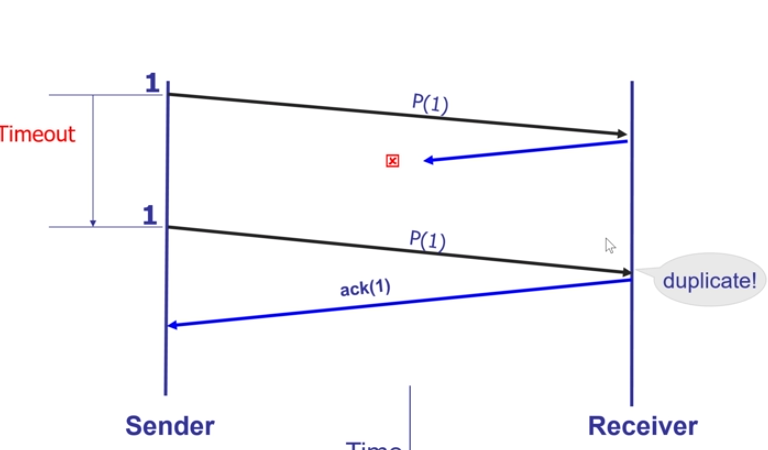

将message切成segments，到了接收端再重组。

为什么需要一个传输层，host有很多应用，每个应用会发送信息给一个应用，一个host可能有多个应用同时在通信，多个应用之间需要复用。

另外IP层的协议比较弱，理论上不做任何保障，丢包了什么的都正常，传输层提供了保障。

不同应用的信息需要放在一起发送，接收方拿到之后要发给不同的应用

TCP,UDP是两种常用的协议，UDP是最简单的，就是IP层协议加上复用分解功能，TCP更完善，是现在广泛使用的

IP加上端口能用来表示应用

操作系统里面保存了socket和port的映射，UDP每一个port对应一个socket，TCP每一个应用对应多个socket，每一个socket对因一个连接

传输层报文中有port信息，ip信息在ip层报文里面

多路分解有两种，UDP是无连接的

P1同时和P3P4通信，没有建立链接，谁都可以和P1通信

TCP是建立连接的

实际上P234是一个进程，分为多个线程

真实传输过程中可能会出现很多问题，传输层怎么解决这些问题

解决数据包出错问题：收到包之后进行一个反馈，没问题、有问题

另外包要有一个序号，让接收方知道接收的是哪一个包

解决丢包问题：这个包超时没有得到反馈，那就再发送一次

反正没有收到ack就视为丢包，虽然第二种情况对于receiver来说出现了数据冗余，但是没有办法，通过序列号我们知道是怎么冗余的，丢弃冗余即可

这是另外一种超时，传输的延时太大

上面我们讲的就是这个stop and wait，非常好理解，但是效率非常低

进行流水线式的发送，一次发多个包，一次发多个ack，这需要双方有buffer

吞吐量的计算，send and wait=data/rtt

### comulative ack

receiver ack Bnew+1

### selecitve ack

收到哪个ack哪个，更精确一些，但是实现会更复杂

## 发生了错误，怎么重发

### go back n

receiver 有一个没收到，后面的就都不收了，从我没收到的那个开始全部都要重新传

### selective repeat

总结

