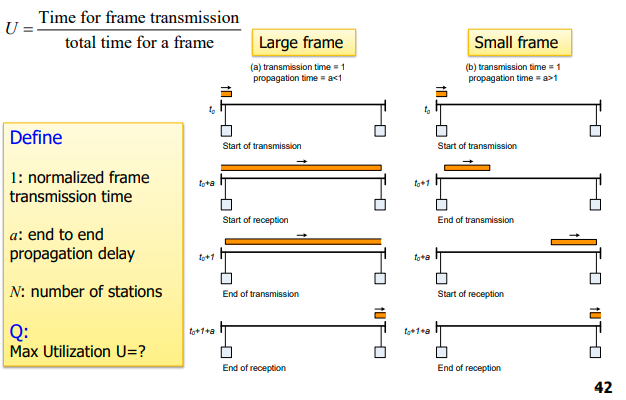
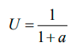
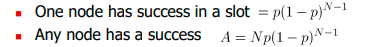
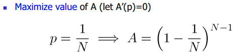
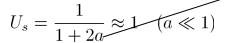
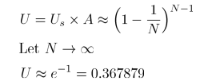
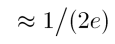
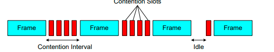

## 传输效率

### Point-to-Point Link 

### 令牌环 tokenring

a/N是令牌移动的时间，令牌在传输完成且接收到转了一圈回来的信息之后释放令牌

### Slotted ALOHA

A是这个时隙有节点能成功发送frame的概率，最大是

传输效率

~~反正传输效率就是接近1，书上没写这个东西，2a不能完全理解，a<<1也不知道是咋回事，反正就这么记就完事了~~

### Pure ALOHA

### CSMA/CD p-persistent

