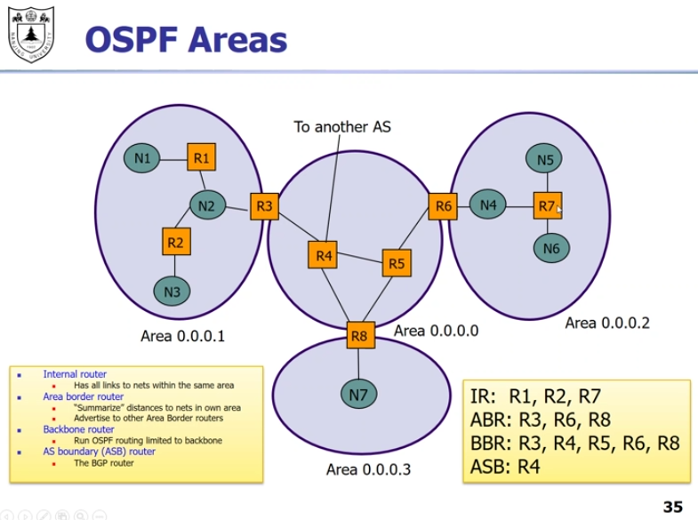
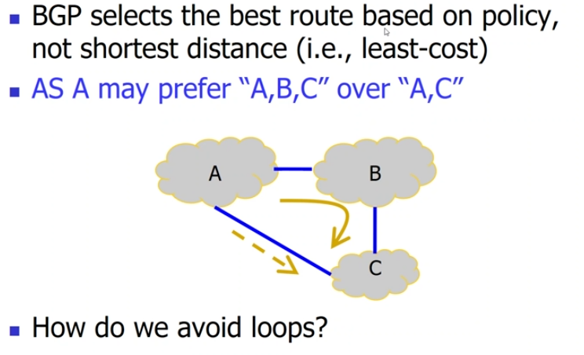
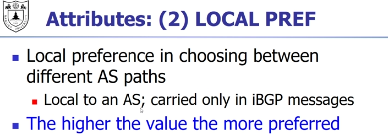
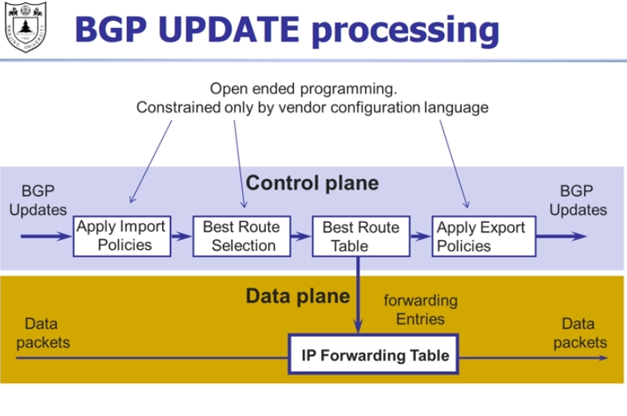

每一个AS内部运行相同的协议，不同的AS的协议可以不一样

每一个AS有（至少）一个gateway router，相当于国家的外交部，对内用AS内部的协议，对外（其他网关路由器）使用统一的标准协议

AS的定义，每一个AS有一个AS number

中国电信，中国联通，他们的省公司，小型的AS，大型的互联网恭公司可以有自己的AS，可以直接和中国电信合作，peering center是新生事物，方便ISP沟通

AS之内用IGP,AS之间用EGP

IGP注重表现，我这个as注重带宽，那个as注重延迟，EGP注重策略，比如我的信息不想经过某个国家的路由

常用的协议，用距离向量的，用Dijkstra的，第三个是私有的基本不用

复习：

距离向量的：

- 每个节点只和自己的邻居交换信息
- 每个节点保留距离向量，一轮一轮交换，收敛

Dijkstra:

每个点知道自己和邻居的距离，广播出去，每一个点都知道所有的信息，然后进行计算

为什么EGP不能用上面两种算法呢：因为不同的as的策略不一样，注重的东西不一样，所以没法用一个同意的计算方法。另外子网内部有私密性，我有些信息并不想和你交互。第

对于距离向量，没法做到我想避开某个节点。

对于最短路，要广播的信息太多了。

每个节点要传递给相邻的节点，我到某个点的完整路径。距离，花费是可以不传递的，但是路径是必须的。

这样就能实现各种策略，我想走更少的as啊，不想经过特定的as啊，一定要经过某个路由啊等等

# AS内部协议

## RIP

用跳数作为指标，30秒发送一次message，180s不回应视为失联

后来进行了小的改进，用排队长度代替跳数作为距离。

实际上是两个应用程序在交互，拿到信息之后去更新第三层的forwarding table

## OSPF

OSPF更新一些，现在在大部分领域替代掉了RIP

每十秒flood一次，内容是和相邻as的距离，这个距离每一条边是一个指定的值（两个方向的值可能不同），在IP层上面传输，不需要经过UDP和RIP不同

networks(N10),host(H1)s,bgp routers(R12)都可以是目的地

每一个router都能算出一个最短路径树

forwardingtable里面放的是下一跳信息

作为比较新的协议，OSPF有一些更好的特性

有加密，安全性更好

如果有多条路径距离相同，也可以处理

路径的cost是自己设置的，可以根据想要的效果灵活设置

支持多播协议

如果as过大，还可以进一步分层

as还可以分成area,每一个router只需要知道area内的所有信息即可，就像gateway router 一样，有area border routers

所有的area连接到back bone area

ASB是和其他as打交道的router

# AS间协议：BGP

注重policy策略，as要求自主性，as内部怎么做不要你管，as还要求隐私性，内部的信息我有些不想提供给你

peer：互相提供对等服务。中国电信和中国联通，他们之间谁也不给谁钱

如果bc不能peer,那么要经过a，bc只是赚差价，如果bc能peer，那么钱都归bc

红色的线不被允许，b表示，你们两个的用户交流，为什么我无偿提供资源

目的地是IP地址而不是as，节点是as，link代表两个点既有物理连接，还有商业关系

每一个as可以选择自己发出什么，对于接收的信息，也可以做出选择

BGP是从位置向量演变来的，分布式的计算，但是有四点不同

as间选路不一定选择最短路径，可能我就是不想经过那个节点，或者其他原因 

广播的是整条路径

两个好处：不会出现loop，整条路径都给出来了很容易判loop，另外这样as可以选择路径

第三as可以选择不广播，即使有物理路径，比如c就不想给b提供服务，那他可以不广播这条路径，让别人都不知道有这条路径

第四可以聚合网络

协议规定了，发送的message的类型，格式，接到某个类型的message之后我们应该做什么

sessions 会话

iBGP将域外的信息告诉域内的所有router，从域内怎么走到border router需要用IGP

基本的message，open,出错，update，我还活着

有一些attribute是本地的，as内部知道就行了不许要通知出去，有一些需要通知出去

这个是ibgp消息，内部知道就行了，不广播出去，我们倾向于选择什么路径

如果两个as之间有多个link，通过med告诉router两个link哪个近，但是as不一定会选择短的，有自主选择权

找最近的地方丢出去

****

