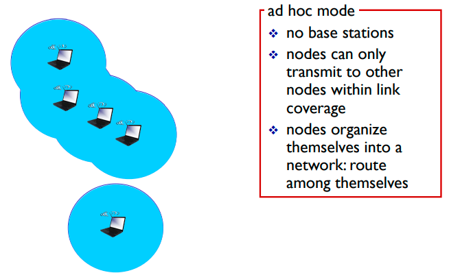
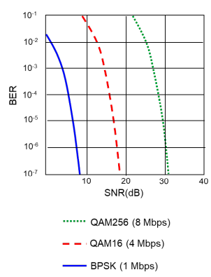
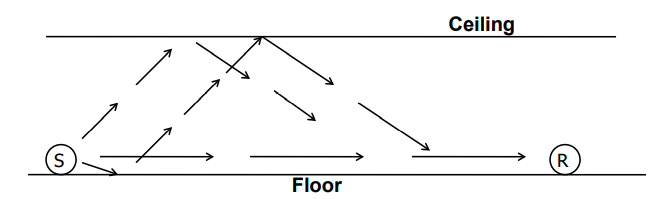
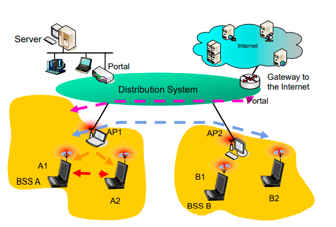
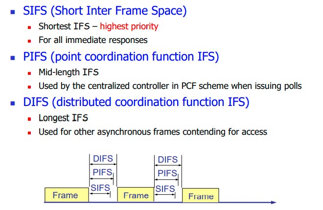
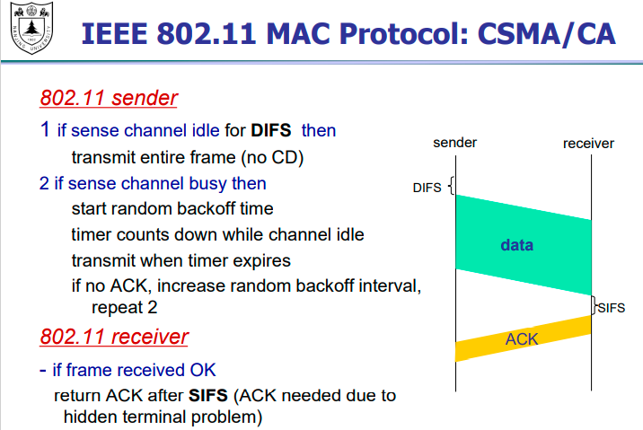

无线网络两个challenge

- 无线
- 可移动：移动用户从一个基站范围走到另外一个基站范围

组成部分：

- wireless host

- base station 基站（大基站（移动，联通的基站），小基站（家里的路由器，AP））

-  wireless link

两种模式

- infrastructure mode  靠基站

- Ad-hoc mode 没有基站，peer-to-peer communication

  

  应用场景比如战争，任何一个节点被干掉，网络还能正常运行

和有线网络的区别

- Decreased signal strength信号的削减

  - SNR 信噪比
  - BER 误码率

  

  

- Multipath propagation 多径效应

- 其他设备的干扰

无线网络协议

低级数据竞争，高级数据控制

帧间隔越短，优先级越高

SIFS：ACK，用于特别长的单元允许连续发送，轮询，clear to send

PIFS：轮询基站谁有实时数据要发

DIFS：优先级最低，进行类似于以太网里面的竞争

无线是没有冲突检测的，因为无线是单功能的，不能一边发送一边冲突检测，用ACK判断是不是发送成功了

在子网之间的移动是不改变IP地址的