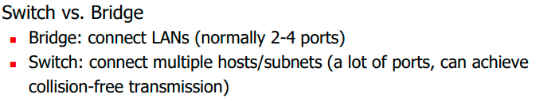

## Bridge

功能：连接两个局域网，store and forward

要求：

- store and forward
- 透明：stations不用知道bridge的出新
- self-learning

因特网的广播：

一层网络上，永远是广播的

二层网络上，mac address是ff才是广播

问题：广播风暴

解决方法：

广播风暴的形成是因为网络里面有loop，去掉环，形成一棵树

一个好的解决方案应该：

- zero configuration 不用users自己配置
- self healing 如果有一个节点坏了，能自己（bridge）调整

这棵生成树应该怎么生成（算法）：

break ties 如果有多个最短路径，以某个算法选择一条

选root的方法：

- 选id（mac address）最小的作为root

- 分布式计算，最后达成一致

- 每个人propose提议一个root，然后相互交换信息，一边更新根节点，一边计算自己到根节点的最短路

address learning

准确传输比flood(广播)要节省开销，所以尽可能记下来一些信息

有一个信息从地址x经过端口y过来，那就知道x是在端口y那个方向，那bridge就记下来，下次有发给x的信息，直接从端口y发就行了，不用flood

通过学习B1知道S1是在左面的端口，所以S2向S1发送信息时，B1不会向右面传播信息

如果不知道S1的 信息，就往又名flood

三种情况：

- 目的地是是发来的地方，那就drop

- 目的地是我不清楚的地方，那就flood

- 目的地不是发来的地方而且是我知道的地方，那就定点爆破

这个信息表格要更新，有时间限制

## hub

hub和bus没区别，就是一条总线

## switch

升级版的bridge

为什么要有交换机：广播域隔离，提升带宽

交换机让A到A',B到B'能同时全速进行，没有冲突，没有竞争，而且其他人听不到

理想情况下时这样，但是有时候的冲突时无法避免的，比如AB同时想给A'发信息

“立交桥”

frame是帧